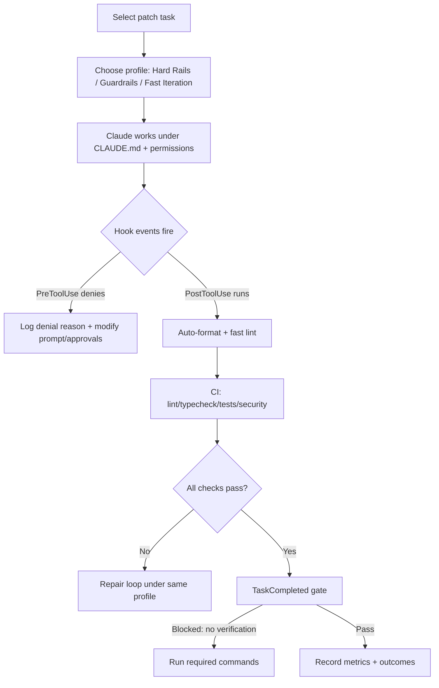

# Strict-by-default guardrail suite to implement in your repo for Claude Code

## Overview and escalation philosophy

You asked for a **luxurious, highly restrictive** starting point that you can **relax later** if Claude struggles. The strongest “guardrail-first” pattern, reflected in Claude Code’s own best practices, is to treat prompts, repo rules, and verification as **a system**: persistent instructions (**CLAUDE.md**), deterministic enforcement (**hooks**), and non-negotiable verification criteria (tests/checks) so you are not the only feedback loop. citeturn1view0turn11view0

I recommend implementing this in three operational “profiles” you can toggle per branch/team:

- **Hard Rails (default)**: narrow permissions, blocked edits to sensitive areas, hooks enforcing checks, strict complexity/size limits, and required CI checks before merge. citeturn11view1turn14view0turn10search0turn10search6  
- **Guardrails (balanced)**: relax a few size thresholds and allow test edits under a label/flag, but keep verification and security scanning mandatory. citeturn10search0turn10search6  
- **Fast Iteration (temporary)**: for explorations, allow more autonomy but only in sandbox/isolation (worktree, container, or ephemeral branch), then re-run Hard Rails before merge. Claude Code explicitly recommends careful permission modes and isolation for more permissive operation. citeturn11view1turn6search7  

The remainder is a practical to-do suite you can implement today.

## Claude Code governance assets for your repo

Claude Code has first-class support for **CLAUDE.md**, a project-scoped `.claude/` directory (settings, hooks, skills, subagents), and fine-grained permissions. We’ll lean on those features to make guardrails real and enforceable. citeturn1view0turn11view2turn11view1turn11view0

### Create a repo-level `.claude/` layout

Claude Code docs explicitly describe:
- shared project settings in `.claude/settings.json`, local developer overrides in `.claude/settings.local.json`,  
- skills in `.claude/skills/`,  
- subagents in `.claude/agents/`,  
- deterministic hooks configured via settings JSON. citeturn11view2turn1view0turn11view0turn14view0

Recommended layout:

```text
repo/
  CLAUDE.md
  .claude/
    settings.json
    hooks/
      block-dangerous-bash.sh
      forbid-test-edits.sh
      run-fast-checks.sh
    skills/
      patch-workflow/
        SKILL.md
      verification/
        SKILL.md
    agents/
      verification-specialist.md
      architecture-linter.md
    guidelines/
      style-functional.md
      style-clean-code.md
      architecture.md
      testing.md
  pyproject.toml
  .pre-commit-config.yaml
  semgrep.yml
  .importlinter
  .github/workflows/ci.yml
```

This design uses Claude Code’s intended extension points: CLAUDE.md for high-level rules, `.claude/skills/` for reusable workflows, `.claude/agents/` for specialized roles, and hooks for “zero-exceptions” enforcement. citeturn1view0turn11view0turn11view2

### Add a strict, minimal CLAUDE.md that imports “long” guidance

Claude Code explicitly warns that **bloated CLAUDE.md files cause Claude to ignore instructions**, and recommends keeping CLAUDE.md short and importing additional instructions via `@path/to/import`. citeturn1view0

Start with `/init` and then replace with something like:

```md
# CLAUDE.md

## Non-negotiables (YOU MUST)
- Make the smallest possible change that satisfies the request (minimal diff).
- Do not refactor unrelated code. Do not reformat files unrelated to the change.
- Do not modify tests unless explicitly instructed.
- Always run: lint + typecheck + tests before saying “done”. Report the exact commands and outputs.

## Code style
- Prefer functional style: pure functions, explicit inputs/outputs, avoid shared mutable state.
- Prefer small functions and small files. Enforce thresholds from CI (see checks).
- Prefer self-describing names; avoid one-letter names except in tight scopes.

## How to work in this repo
See @.claude/guidelines/style-functional.md
See @.claude/guidelines/style-clean-code.md
See @.claude/guidelines/testing.md
See @.claude/guidelines/architecture.md
```

The import mechanism (`@...`) and the recommendation to encode workflow rules + test commands in CLAUDE.md are described in the official best practices. citeturn1view0

### Encode your “Clean Code” goals without going OOP-heavy

You want the style philosophy of entity["book","Clean Code","robert c. martin 2008"] (small, single-purpose functions; meaningful names; low argument counts) without overcommitting to OOP. The book’s bibliographic provenance and authorship are publicly documented. citeturn8search3turn8search13

Put the detailed checklist in `.claude/guidelines/style-clean-code.md` and keep CLAUDE.md short. Claude Code itself says not to include “self-evident” long tutorials in CLAUDE.md and to treat it like code you prune and test. citeturn1view0

## Hard Rails code-quality constraints that match your preferences

You asked for:
- functional-first style,
- functions **< 30 lines**,
- files **< 300 lines**,
- small argument counts,
- single responsibility / low complexity.

This is enforceable today with a combination of:
- fast lint/format,
- type checking,
- function-length enforcement,
- module-length enforcement,
- complexity and branch-count enforcement,
- architectural import constraints.

### Enforce “functions < 30 lines” deterministically

Use the Flake8 plugin **flake8-max-function-length**, which provides a single rule `MFL000` and supports a configurable maximum function length (default 50) and whether to include docstrings/comments/empty lines. It also shows an example of running it via pre-commit with `additional_dependencies`. citeturn12view0

Hard Rails default: **30 lines**, excluding docstrings/comments/blank lines (strict, but practical).

### Enforce “files < 300 lines” deterministically

Use Pylint’s **too-many-lines (C0302)**, which exists specifically to flag modules with too many lines for readability. citeturn0search12turn0search3

Hard Rails default: `max-module-lines = 300`.

### Enforce “few arguments” and “low branching,” aligned with clean-code preferences

Pylint and Ruff both expose Pylint-derived rules:
- **too-many-arguments (R0913 / PLR0913)** citeturn2search0turn2search8turn13search1  
- **too-many-branches (R0912 / PLR0912)** citeturn2search1turn2search17  
- **too-many-statements (R0915 / PLR0915)**, which explicitly recommends splitting functions. citeturn9search1turn0search2  
- **too-many-return-statements (R0911 / PLR0911)** citeturn9search17turn13search9  

Hard Rails defaults I recommend:
- max args: **4** (tight; relax to 6 later)  
- max branches: **10–12** (start at 10)  
- max statements: **25–30** (start at 25; Ruff defaults are higher) citeturn0search2turn13search13  
- max complexity (McCabe): **10** (this is a common default threshold in tooling docs and descriptions) citeturn13search8turn13search17  

### Add “architecture can’t rot” constraints

To keep code modular as Claude edits accumulate, enforce explicit architecture constraints on imports. **Import Linter** is designed to impose constraints on imports between modules and can enforce layered architectures or forbidden dependencies. citeturn7search0turn7search4turn13search7turn13search3

Add it if you have any meaningful package/module structure (even a simple `src/` layering).

## Deterministic enforcement: hooks, pre-commit, CI, and protected branches

This is where “strict” becomes real: Claude Code hooks make actions happen **every time**, rather than relying on the model to remember. citeturn11view0turn14view0

### Claude Code permissions: start with deny-by-default for risky actions

Claude Code supports:
- ordered allow/ask/deny permission rules,
- permission modes including `plan` and `dontAsk`,
- project-level settings in `.claude/settings.json`. citeturn11view1turn11view2

**Hard Rails recommendation**:
- defaultMode: `dontAsk` (auto-deny tools unless explicitly allowed),
- deny reading secrets and env files,
- allow only safe Bash commands required for your checks (tests, lint, typecheck).

Example `.claude/settings.json` skeleton:

```json
{
  "$schema": "https://json.schemastore.org/claude-code-settings.json",
  "defaultMode": "dontAsk",
  "permissions": {
    "allow": [
      "Bash(python -m pytest *)",
      "Bash(ruff check *)",
      "Bash(ruff format *)",
      "Bash(mypy *)",
      "Bash(git status)",
      "Bash(git diff *)",
      "Read(*)",
      "Grep(*)",
      "Glob(*)"
    ],
    "deny": [
      "Read(./.env)",
      "Read(./.env.*)",
      "Read(./secrets/**)",
      "Bash(curl *)",
      "Bash(wget *)"
    ]
  }
}
```

Project and user settings scope, plus how deny rules prevent sensitive file access, are documented in Claude Code settings/permissions docs. citeturn11view2turn11view1

### Claude Code hooks: enforce “zero exceptions” rules

Claude Code describes hooks as deterministic lifecycle automation and explicitly lists common patterns like “auto-format after edits” and “block edits to protected files.” citeturn11view0turn14view0

#### Hook 1: ban destructive Bash commands

Claude Code’s hooks reference includes a concrete example of a `PreToolUse` hook that blocks `rm -rf` by inspecting JSON stdin via `jq` and returning a deny decision. citeturn14view0

You can adapt that verbatim pattern into `.claude/hooks/block-dangerous-bash.sh` and expand the deny list to include `curl`, `wget`, or any “data exfil” commands you don’t want the agent to run.

#### Hook 2: forbid edits to tests by default

Your “strict first” philosophy strongly benefits from: **code changes must be made in production code; tests are only edited when explicitly allowed**. Add a hook that denies `Edit` operations in `tests/**` unless the user prompt contains an override token.

Mechanically: write a `PreToolUse` hook that denies `Edit` when `.tool_input.file_path` matches `tests/` (the hooks reference shows how to parse tool input and return decisions). citeturn14view0

#### Hook 3: auto-run fast checks after each edit

Claude Code explicitly supports “format files after edits” and “run tests after file changes” patterns via hooks. citeturn11view0turn14view0

Start with a conservative “fast checks” script that runs quickly per file-per-edit:

- `ruff format <file>`
- `ruff check <file>`
- optional: `python -m compileall <file_or_package>`

Then escalate to “full checks” on TaskCompleted (below).

#### Hook 4: block “task completed” unless verification ran

There is a `TaskCompleted` hook event (listed in the hook lifecycle) precisely for gating completion. citeturn14view0

Implement a `TaskCompleted` hook that checks whether:
- tests were run in this session **or**
- CI is green **or**
- the user explicitly acknowledged “skip verification”.

This ensures Claude can’t “declare done” without evidence—directly addressing the trust-then-verify gap highlighted in Claude Code guidance. citeturn1view0turn11view0

### Pre-commit: local guardrail wall

Use **pre-commit** (framework + `.pre-commit-config.yaml`) to make violations fail locally *before* they become PR churn. citeturn3search0turn3search4

Hard Rails `.pre-commit-config.yaml` (Python-first; strict length + secrets):

```yaml
repos:
  - repo: https://github.com/pre-commit/pre-commit-hooks
    rev: v6.0.0
    hooks:
      - id: end-of-file-fixer
      - id: trailing-whitespace
      - id: check-yaml

  - repo: https://github.com/astral-sh/ruff-pre-commit
    rev: v0.15.0
    hooks:
      - id: ruff
        args: [--fix]
      - id: ruff-format

  - repo: https://github.com/pycqa/flake8
    rev: "6.0.0"
    hooks:
      - id: flake8
        additional_dependencies:
          - "flake8-max-function-length==0.10.0"
        args: ["--max-function-length", "30"]

  - repo: https://github.com/Yelp/detect-secrets
    rev: v1.5.0
    hooks:
      - id: detect-secrets
        args: ["--baseline", ".secrets.baseline"]
```

- pre-commit’s config mechanism and purpose are documented. citeturn3search4turn3search0  
- Ruff is a linter + formatter. citeturn3search2turn3search6  
- flake8-max-function-length provides rule `MFL000` and shows this exact pre-commit pattern. citeturn12view0  
- detect-secrets provides baseline scanning workflow. citeturn6search0  

### CI and merge gating: make guardrails non-optional

#### CI checks you should make required

At minimum:
- formatting/lint
- typecheck
- test run
- semgrep scan
- dependency vulnerability scan
- code scanning (if available)

Then require them via protected branches, using GitHub’s “required status checks” on protected branches. citeturn10search0turn10search6

GitHub docs describe that required status checks must be successful (or neutral/skipped) before changes can merge into protected branches. citeturn10search0

#### Secure the CI surface area

GitHub provides a “Secure use reference” for workflow security practices, and you should treat third-party Actions as supply-chain dependencies. citeturn10search1turn10search7

## Programmatic architectural checks for long-term safety

This is the “full architectural enforcement” tier that keeps a repo from slowly decaying under repeated AI edits.

### Import boundaries with Import Linter

Import Linter’s purpose is to enforce constraints on imports between modules and packages (“lint your Python architecture”). citeturn7search0turn7search4

Minimal `.importlinter` example (layering contract):

```ini
[importlinter]
root_package = src

[importlinter:contract:layers]
name = Layered architecture
type = layers
layers =
    src.api
    src.service
    src.domain
    src.infra
```

Import Linter configuration concepts (contracts, ids, formats) are documented. citeturn13search3turn13search7

### Complexity kill-switch with Xenon

If you want a single “architecture debt tripwire,” add Xenon, which fails CI when complexity exceeds thresholds via command-line options. citeturn9search3turn13search2

Hard Rails settings:
- `--max-absolute B`
- `--max-modules A`
- `--max-average A`

Xenon documents these thresholds and that exceeding them returns a non-zero exit code. citeturn13search2

### Dependency hygiene checks

Add deptry to flag missing/unused dependencies in Python projects. citeturn7search2

This directly mitigates a common AI failure: introducing unused deps, missing deps, or drift between imports and declared requirements.

## Security rails: secrets, deps, and scanning

LLM-assisted coding makes it easy to accidentally paste tokens, introduce risky patterns, or add vulnerable dependencies.

### Secrets scanning

Pick one of:
- detect-secrets baseline scanning approach citeturn6search0  
- gitleaks repository/file/stdi n scanning citeturn6search1turn6search5  

If you want maximal strictness: use detect-secrets for baseline + gitleaks in CI for “diff scanning”.

### Dependency vulnerability scanning

Use:
- pip-audit to scan installed environments or requirements for known vulnerabilities citeturn5search6  
- gh-action-pip-audit to integrate into CI citeturn5search2  
- OSV-Scanner action for broader ecosystem support citeturn5search3turn5search11  

### Code scanning

If you’re on GitHub integrated scanning, add CodeQL as a PR gate (especially for security-sensitive repos). The CodeQL repository is public and commonly used for code scanning. citeturn3search3turn3search11  

## Relaxation levers and “what to loosen first”

The goal is to start strict, then relax *only the constraints that block productivity while preserving safety*.

Here’s an ordered relaxation strategy:

- **First loosen**: function length (30 → 40), max statements (25 → 35), max args (4 → 6). These limits can conflict with real-world code and may produce busywork refactors. Ruff/Pylint-derived rule thresholds are configurable. citeturn0search2turn13search13turn12view0  
- **Second loosen**: allow test edits *only when requested* or when a “tests-needed” token is present; keep a hook-driven default ban. Hooks exist specifically to block protected-file edits deterministically. citeturn11view0turn14view0  
- **Third loosen**: permission mode (from `dontAsk` to `default` for smoother work) once you trust the hook constraints and CI gates. Claude Code permission modes are explicitly designed for this. citeturn11view1  
- **Do not loosen early**: required status checks for merge, secrets scanning, and dependency scanning—these are high-signal, low-regret rails. citeturn10search0turn6search0turn5search6  

## Converting these guardrails into causal-audit interventions

Because your project is about causal reasoning failures on patch tasks, this strict suite is not just “engineering hygiene”—it’s an experimental apparatus.

### Knobs to toggle in ablations

Treat each of these as a controlled intervention:
- CLAUDE.md strictness: minimal vs expanded vs imported guidance strategy (Claude docs warn about overly long CLAUDE.md reducing adherence). citeturn1view0  
- Hooks on/off: particularly “ban test edits,” “block completion unless verified,” “auto-format after edits,” and “block dangerous bash.” Hooks are explicitly deterministic enforcement points. citeturn11view0turn14view0  
- Static rails intensity: (Ruff-only) → (Ruff + function-length plugin) → (+Pylint module-size) → (+Import Linter) → (+Xenon). citeturn3search2turn12view0turn0search12turn7search0turn13search2  
- Test strength: unit tests only → +property tests (Hypothesis) → +mutation testing (mutmut). citeturn4search3turn5search0  

### What to log on every run

Extend your existing schema with:
- `guardrail_profile`: `hard_rails|guardrails|fast_iteration`
- `claude_hooks_enabled`: list of hook ids that fired
- `policy_violations`: which hook denied what (tool input + reason)
- `size_metrics`: function length violations (`MFL000`), module length (`C0302`), complexity grades (Xenon)
- `verification_evidence`: commands Claude ran, outputs, and whether completion was blocked until they existed

These are straightforward to observe because hooks operate on structured JSON inputs and can return structured decisions and reasons. citeturn14view0  

### A simple experimental protocol as a flowchart



This aligns with Claude Code’s explicit positioning of hooks as deterministic enforcement points in the agent lifecycle. citeturn14view0turn11view0  

---

If you want the “most luxurious” version of this, the next layer would be: (1) adding **subagents** dedicated to verification and architecture review inside `.claude/agents/` (Claude Code explicitly supports custom subagents), and (2) implementing a `TaskCompleted` gate that refuses completion unless a structured “verification report” exists (tests + typecheck + lint evidence). citeturn1view0turn8search2turn14view0