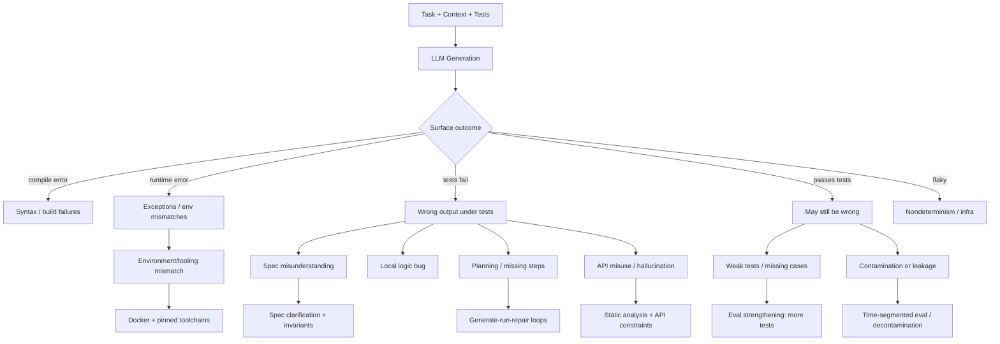

# State of the Art on LLM Code-Generation Failures and Mitigations

## Executive summary

This report synthesizes a “one-level-deep” crawl from the seed arXiv paper **“Where Do LLMs Still Struggle? An In-Depth Analysis of Code Generation Benchmarks”** (FailureBench) and every distinct URL cited in its Introduction/background, plus a targeted scan of practitioner engineering guidance and tooling. Snapshot date: **2026-03-23 (America/New_York)**. citeturn36view3turn39view0turn12view0turn35search2turn35search15turn30view0

A consistent picture emerges across academic benchmarks (HumanEval/MBPP-style function synthesis, library/tool-heavy benchmarks, and repo-level patch benchmarks) and practitioner systems (agents, IDE copilots, CI guardrails):

Failures are dominated by **semantic mismatch** rather than syntax. Even when code compiles and runs, it often encodes the wrong specification, misses conditions, or passes weak tests while being incorrect. The seed study found that across **865 tasks** from HumanEval, MBPP (subset), LiveCodeBench (LCB-V6), and BigCodeBench-Hard, there are **114 tasks** that **all evaluated models failed**; critically, failure clusters were only weakly explained by static code complexity except (most strongly) on LiveCodeBench. citeturn36view0turn36view3turn39view0

The seed paper’s **task-level failure inspection** yields four recurring patterns with counts (among those consistently-failed tasks):  
- **Wrong problem mapping** (e.g., collapsing a nuanced spec into a familiar “problem class”): HumanEval 1, LiveCodeBench 20, BigCodeBench-Hard 24. citeturn38view0turn39view0  
- **Flawed or incomplete algorithm design** (correct direction, missing steps/assumptions): MBPP 1, LiveCodeBench 31, BigCodeBench-Hard 35. citeturn38view0turn39view0  
- **Edge-case mishandling** (boundary conditions, recursion into subdirs, special values): MBPP 1, LiveCodeBench 1, BigCodeBench-Hard 27. citeturn38view0turn39view0  
- **Formatting mistakes** (strict I/O or type/quoting expectations): LiveCodeBench 10, BigCodeBench-Hard 32. citeturn38view0turn39view0  
The authors additionally highlight **benchmark design artifacts**—underspecified prompts and overspecified/hidden tests—especially in BigCodeBench-Hard. citeturn39view0

The deeper background literature reinforces and refines those patterns into an actionable taxonomy:

- HumanEval-style error analyses show that **most incorrect generations are runnable** (no compile error), but contain semantic defects; in one manual analysis of **557 incorrect HumanEval solutions**, **>84%** required **>50 edits** to repair, and **missing/incorrect code blocks** account for **>40%** of syntactic error characteristics. citeturn32view3turn34view0  
- Test-suite weakness and evaluation leakage are now first-order concerns: EvalPlus reports **HumanEval+ (≈80× tests)** and **MBPP+ (≈35× tests)** and documents **pass@k drops up to ~19–29%** under stricter testing, indicating that many “passing” solutions exploit test gaps. citeturn25view1turn9search0  
- Contamination has become severe enough that entity["company","OpenAI","ai lab, us"] publicly stopped reporting SWE-bench Verified results in February 2026, citing (i) tests rejecting correct solutions and (ii) evidence that frontier models have seen tasks/patches in training; in an audit slice, **≥59.4%** of commonly-failed Verified tasks had flawed test design, including “too narrow” and “too wide” tests. citeturn30view0  
- Modern benchmarks intentionally push beyond “single-function synthesis”: LiveCodeBench adds time-segmented evaluation to detect contamination and supports broader scenarios including **self-repair**; BigCodeBench targets **tool/library usage** (139 libraries) with high branch coverage tests; SWE-bench targets **repo-level patches** evaluated via fail-to-pass tests in containerized environments. citeturn20view2turn19view0turn22view2turn22view0

For your use case—**causal auditing of why models fail on small patch/edit tasks (~40 test cases)**—the state of the art suggests a practical framing:

1) Treat “LLM failure” as a **causal graph** that includes not only model reasoning, but also **specification clarity, context retrieval, environment determinism, and evaluation/test artifacts**. citeturn39view0turn30view0turn41view0  
2) Instrument your pipeline to distinguish the dominant surface classes (compile/runtime/test failure, wrong output, flaky/nondeterministic) and map them to causal loci (spec misunderstanding vs local reasoning vs API misuse vs environment). citeturn34view0turn30view0turn29search3  
3) Use practitioner mitigations—**generate→run→repair loops, test-first prompting, static-analysis gates, sandboxing, and repository instruction files (AGENTS.md / agent rules)**—not as “fixes,” but as **controlled interventions** to isolate causes. citeturn35search2turn35search8turn35search15turn40search10turn22view0  

## Scope and method

The seed paper evaluates six LLMs on four function-generation benchmarks using **pass@1** (single sample) and identifies **114 tasks** consistently failed by all tested models. The experimental artifacts and analysis scripts are released in the FailureBench repository. citeturn36view0turn36view3turn12view0

Per your instruction, this report goes “one level deep” into the seed paper’s Introduction/background URLs (benchmark papers and reports) and extracts: benchmark properties, reported failure modes/taxonomies, and evaluation pitfalls such as test insufficiency and contamination. It then augments with non-academic practitioner resources (official docs/blogs and open-source agent/tool documentation) describing mitigations like execution loops, CI gates, and guardrails. citeturn39view0turn35search0turn35search2turn35search15turn22view0turn30view0

A small but important housekeeping note for reproducibility: the seed paper’s reference [4] labels “LiveCodeBench” but links to arXiv:2404.00699, which is a contamination-detection survey; LiveCodeBench itself is arXiv:2403.07974 with an official website/repo. This report covers **both** (because the URL is in the seed paper’s intro references, and LiveCodeBench is required for your benchmark comparison). citeturn39view0turn41view0turn20view2turn20view1

## Paper cards and benchmark comparison

### Paper cards

Below are “paper cards” for the seed paper and each Introduction/background-cited work (plus the mislinked contamination survey URL that appears in the seed references). For authors, to keep the report readable while remaining attributable, I list the **lead author** with “et al.”; full author lists are available in each cited artifact.

**Seed paper card**  
Title: Where Do LLMs Still Struggle? An In-Depth Analysis of Code Generation Benchmarks. citeturn36view3turn39view0  
Lead author: entity["people","Amir Molzam Sharifloo","llm code benchmarks author"] et al. citeturn1view0  
Year: 2025 (arXiv:2511.*; posted Nov 2025). citeturn1view0  
Task type: Function generation from NL specs (with/without context). citeturn36view3turn39view0  
Benchmarks: HumanEval (164), MBPP subset (378), LiveCodeBench LCB‑V6 (175, Jan–Apr 2025), BigCodeBench‑Hard (148). Total 865 tasks. citeturn36view0turn36view3turn39view0  
Evaluation: pass@1 via benchmark test suites; failed-task inspection + static code complexity measurement; identifies 114 universally failed tasks. citeturn36view0turn36view3turn39view0  
Key results: Complexity correlates strongly with failure mainly on LiveCodeBench; weak/non-significant elsewhere. citeturn39view0  
Explicit failure modes: Wrong problem mapping; flawed/incomplete algorithms; edge-case handling; formatting strictness; plus prompt ambiguity & test rigidity. citeturn38view0turn39view0  
Limitations: Only four benchmarks; aims to extend to repo-level benchmarks like SWE-bench. citeturn38view3  

**Background card**  
Title: Cybersecurity Risks of AI-Generated Code (report). citeturn37view0  
Lead author: entity["people","Jessica Ji","cset report author"] et al. citeturn37view0  
Year: 2024. citeturn37view0  
Task type: Security-focused evaluation of AI-generated code snippets (not a standard benchmark). citeturn37view0  
Evaluation: Prompts designed to elicit buggy/insecure code; five LLMs; reports bug prevalence and policy implications. citeturn37view0  
Key results: Identifies three risk categories; “almost half” of generated snippets in their evaluation contained impactful bugs with exploitation potential. citeturn37view0  
Explicit failure modes: Insecure code generation; vulnerability to attack/manipulation; downstream feedback loops and supply-chain impacts. citeturn37view0  
Limitations: Narrow scope; emphasizes difficulty/complexity of evaluating security and lack of training-data transparency. citeturn37view0  

**Background card**  
Title: Evaluating Large Language Models Trained on Code (Codex). citeturn32view0  
Lead author: entity["people","Mark Chen","codex paper author"] et al. citeturn32view0  
Year: 2021. citeturn32view0  
Task type: Python function synthesis from docstrings (introduces HumanEval). citeturn32view0  
Benchmarks: HumanEval (new set); discusses repeated sampling effectiveness. citeturn32view0  
Evaluation: pass@k; functional correctness via tests; repeated sampling to improve pass rates. citeturn32view0  
Key results: Reports large gains from repeated sampling; documents limitation patterns. citeturn32view0  
Explicit failure modes: Difficulty with long chains of operations; difficulty binding operations to variables (a concrete early articulation of “multi-step plan fidelity” errors). citeturn32view0  
Limitations: Security and broader impacts discussed; benchmark scope is limited to small Python programs. citeturn32view0  

**Background card**  
Title: Program Synthesis with Large Language Models (introduces MBPP). citeturn8view4  
Lead author: entity["people","Jacob Austin","mbpp paper author"] et al. citeturn8view4  
Year: 2021. citeturn8view4  
Task type: Python program synthesis from short natural-language descriptions + tests. citeturn8view4turn24view0  
Dataset/benchmark: MBPP (~974 tasks; crowd-sourced; ~3 tests each in the repo release). citeturn8view4turn24view0  
Evaluation: Execution against provided test cases; few-shot prompting conventions; train/test splits described in dataset README. citeturn24view0  
Explicit failure modes: Not framed as a taxonomy, but MBPP’s structure makes it sensitive to spec parsing, basic library usage, and edge cases. citeturn24view0  
Limitations: Limited test coverage (3 tests/problem in base release); crowd-sourced prompts can be underspecified. citeturn24view0  

**Background card**  
Title (URL in seed refs): A Comprehensive Survey of Contamination Detection Methods in Large Language Models. citeturn41view0  
Lead author: entity["people","Mathieu Ravaut","contamination survey author"] et al. citeturn41view0  
Year: 2024 (revised through 2025; accepted TMLR July 2025). citeturn41view0  
Task type: Evaluation-methods survey (not code-gen-specific). citeturn41view0  
Key results: Argues contamination is “quickly becoming critical,” especially for closed models where training data is not trackable; calls for systematic contamination-bias accounting and better detection methods. citeturn41view0  
Failure modes relevant to your audit: “False progress” due to training exposure is an evaluation failure mode that can masquerade as reasoning improvement. citeturn41view0turn30view0  
Limitations: Survey scope; detection methods vary by access level (open vs closed). citeturn41view0  

**Background card**  
Title: LiveCodeBench: Holistic and Contamination Free Evaluation of Large Language Models for Code. citeturn20view2turn20view1  
Lead author: entity["people","Naman Jain","livecodebench paper author"] et al. citeturn20view1  
Year: 2024. citeturn20view2  
Task type: Multiple scenarios (code generation, self-repair, code execution, test output prediction), built from continuously collected contest problems. citeturn20view2turn20view1turn20view3  
Language coverage: Currently focuses on Python only (explicit limitation). citeturn31view0  
Evaluation method: Time-segmented release dates to probe contamination; tests for correctness; provides dataset versions (e.g., release_v1/v2/v3) in repo docs. citeturn20view1turn20view3  
Key results: Time-based splits reveal performance drops consistent with contamination; expands evaluation beyond pure synthesis. citeturn20view1turn31view2  
Failure modes: Highlights contamination and overfitting as reasons that classic benchmarks can mislead; self-repair scenario directly measures repair-loop competence. citeturn20view2turn31view2  
Limitations: Python-only; continuous updates complicate “static leaderboard” comparisons. citeturn31view0turn20view3  

**Background card**  
Title: BigCodeBench: Benchmarking Code Generation with Diverse Function Calls and Complex Instructions. citeturn19view0turn21view0  
Lead author: entity["people","Terry Yue Zhuo","bigcodebench paper author"] et al. citeturn21view0  
Year: 2024 preprint; positioned as ICLR’25 in repo materials. citeturn21view0turn19view0  
Task type: Function-level code generation with realistic tool/library usage. citeturn19view0turn21view0  
Dataset: 1,140 Python tasks; 723 function calls across 139 libraries and 7 domains; ~5.6 tests/task with ~99% average branch coverage. citeturn19view0  
Evaluation: Execution-based; repo provides multiple execution backends and notes determinism pitfalls (batch inference variance). citeturn21view0  
Key results: Raises difficulty via complex instructions and tool use; explicitly emphasizes coverage as a benchmark-quality dimension. citeturn19view0turn19view2  
Failure modes (implied by design): API misuse, wrong library selection, and “reasonable but misaligned” assumptions under strict hidden tests, especially in the Hard subset. citeturn39view0turn21view0  
Limitations: Tool nondeterminism and harness constraints; even authors note challenges adapting stronger test-generation approaches. citeturn19view3  

**Background card**  
Title: SWE-bench: Can Language Models Resolve Real-World GitHub Issues? citeturn8view1turn22view2  
Lead author: entity["people","Carlos E. Jimenez","swe-bench paper author"] et al. citeturn8view1turn22view2  
Year: 2023 (released Oct 2023; published as ICLR 2024 per official site/PDF). citeturn22view2turn17search5  
Task type: Repo-level patch generation (bug-fix/edit). citeturn22view2turn22view0  
Dataset: 2,294 instances from PR/issue pairs across 12 Python repos; evaluation uses fail-to-pass tests in constructed Docker environments. citeturn22view2  
Evaluation method: Apply generated patch; run fail-to-pass and pass-to-pass tests; containerized harness for reproducibility. citeturn22view2turn22view0  
Failure modes: Multi-file context discovery, environment determinism, and test-design issues (underspecification, spurious failures) are central. citeturn30view0turn22view2  
Limitations: Publicly sourced tasks create contamination risk; test design can reject correct fixes or require unstated details. citeturn30view0  

**Background card**  
Title: Is Your Code Generated by ChatGPT Really Correct? Rigorous Evaluation of Large Language Models for Code Generation (EvalPlus). citeturn17search0turn25view1  
Lead author: entity["people","Jiawei Liu","evalplus paper author"] et al. citeturn17search0  
Year: 2023 (with later dataset/tool updates). citeturn17search0turn23view2  
Task type: Rigorous evaluation framework and augmented tests for HumanEval/MBPP. citeturn25view1turn9search0  
Benchmarks: HumanEval+ (≈80× tests), MBPP+ (≈35× tests), plus tooling for safe evaluation in Docker. citeturn25view1turn25view3  
Evaluation method: Execution-based; emphasizes detecting incorrect solutions that pass original weak tests; reports that stricter tests reduce pass@k materially (up to ~19–29% in their report). citeturn9search0turn25view1  
Explicit failure modes: “False positives” from insufficient tests; wrong-but-passing solutions; benchmark leakage risks if used in training. citeturn9search0turn36view0  
Limitations: Still bounded by test generation quality; dataset revisions (e.g., MBPP+ task pruning) reflect ongoing curation. citeturn23view2turn24view0  

**Background card**  
Title: HumanEval Pro and MBPP Pro: Evaluating Large Language Models on Self-invoking Code Generation. citeturn26view3turn27view0  
Lead author: entity["people","Zhaojian Yu","humaneval pro paper author"] et al. citeturn26view3  
Year: 2024 (repo released Dec 2024). citeturn27view0  
Task type: “Self-invoking” code generation—solve a base problem, then use that solution in a related harder problem (progressive reasoning + reuse). citeturn26view3turn27view0  
Evaluation: pass@k; decoding differs by model type; compares to HumanEval/MBPP and EvalPlus variants. citeturn26view0turn26view1  
Key results: Most LLMs show **10–15% absolute** performance drop on self-invoking benchmarks; instruction tuning yields smaller gains than on “base” benchmarks. citeturn26view0turn26view1  
Failure modes: Increased runtime assertion failures; residual TypeError/ValueError indicate type/usage issues under composition; CoT prompting reduces assertion errors in one reported analysis slice. citeturn33view0turn33view4  
Limitations: Relies on generated self-invoking task construction; still Python-centric; emphasizes benchmark as probe for reasoning+composition rather than real repos. citeturn26view3turn27view0  

**Background card**  
Title: Measuring Coding Challenge Competence With APPS. citeturn8view3turn28view0  
Lead author: entity["people","Dan Hendrycks","apps paper author"] et al. citeturn28view0  
Year: 2021. citeturn14search0turn28view0  
Task type: NL-to-Python solutions for coding-challenge problems. citeturn14search0turn14search1  
Dataset: 10,000 problems from one-line to substantial algorithmic challenges; evaluated by tests. citeturn14search0turn14search1  
Evaluation: Execution on test cases (average/strict accuracy + pass@k variants exist in community metrics). citeturn14search0turn14search7  
Explicit failure modes: Reports syntax errors and difficulty scaling; seed paper explicitly excluded APPS to reduce contamination risk because it is widely used for training. citeturn14search0turn36view0  
Limitations: Public benchmark data increases contamination risk; wide difficulty range makes aggregate metrics hard to interpret. citeturn36view0turn41view0  

**Background card**  
Title: Towards Understanding the Characteristics of Code Generation Errors Made by Large Language Models. citeturn10view0turn34view0  
Lead author: entity["people","Zhijie Wang","llm code errors paper author"] et al. citeturn10view0  
Year: 2024 preprint; to appear ICSE 2025 (v3 revised Feb 2025). citeturn10view0  
Task type: Error taxonomy and repair effort for HumanEval failures. citeturn15view0turn34view0  
Dataset: 557 incorrect solutions across six LLMs on HumanEval’s 164 tasks. citeturn32view3turn15view0  
Evaluation method: Execution-based identification of incorrect solutions; manual localization & repair via open coding + thematic analysis; compares semantic vs syntactic error characteristics. citeturn15view0turn34view0  
Key results: Many errors are multi-line; most incorrect solutions are compilable/runnable; **>84%** of incorrect code required >50 edits; missing/incorrect code blocks are a dominant location class (>40% of syntactic characteristics). citeturn15view0turn34view0  
Explicit failure modes: Missing conditions/steps; wrong logical direction; incorrect function names/arguments; code block/if-statement errors; “hallucinated” method calls (notably for GPT‑3.5 in their analysis). citeturn34view0turn32view3  
Limitations: Uses proxy complexity metrics; focuses on single benchmark (HumanEval) and greedy decoding; acknowledges insufficient tests (found 19 “passes tests but incorrect” cases). citeturn32view3turn15view0  

### Benchmark comparison table

The following table summarizes the benchmarks that dominate the seed paper and its intro citations, plus the derived “Plus/Pro” variants. It emphasizes the dimensions you asked for: task scope, language coverage, execution vs static evaluation, test risks, contamination risk, and metrics.

| Benchmark | Task scope | Lang coverage | Eval type | Test coverage & artifact risk | Contamination risk | Typical metrics |
|---|---|---|---|---|---|---|
| HumanEval | Single-function synthesis from docstring | Python | Execution on unit tests | Average ~7.7 tests/task; can miss edge cases; manual analysis found “passes tests but incorrect” cases. citeturn32view3turn23view0 | Public & widely used; exposure in training can inflate scores. citeturn41view0turn30view0 | pass@1, pass@k. citeturn32view0 |
| MBPP | Short NL-to-code + tests (entry-level) | Python | Execution on tests | Base release: ~3 tests/problem; crowd-sourced prompts; makes edge-case omissions likely. citeturn24view0 | Public and reused; “Plus” variants exist specifically to reduce false positives. citeturn25view1turn9search0 | pass@k (common). citeturn24view0turn32view0 |
| APPS | Coding-challenge NL→Python solutions (broad difficulty) | Python | Execution on tests | Large difficulty spread; aggregate scores can hide failure clusters; widely used for training. citeturn14search0turn36view0 | Seed paper excludes APPS due to training contamination risk. citeturn36view0 | pass@k, strict/avg accuracy variants. citeturn14search7turn14search0 |
| LiveCodeBench | Holistic eval across scenarios (code gen, self-repair, etc.) from contest problems with release dates | Python (currently) | Execution; time-sliced evaluation | Designed to support time-based contamination detection; continuous updates complicate “fixed” leaderboards. citeturn20view2turn20view3turn31view0 | Explicitly targets contamination; uses release dates to test generalization after cutoff. citeturn20view1turn31view2 | pass@1 for code gen; scenario-specific scores. citeturn20view2turn20view1 |
| BigCodeBench | Function-level synthesis with complex instructions + diverse library/tool calls | Python | Execution; multiple backends; coverage-aware | ~5.6 tests/task; ~99% avg branch coverage; still faces nondeterminism from tool calls and harness constraints. citeturn19view0turn19view3turn21view0 | Public benchmark; repo includes “decontamination” tooling; still susceptible if trained on. citeturn21view0turn41view0 | pass@1/pass@k; leaderboard % pass. citeturn21view0turn19view0 |
| BigCodeBench-Hard | Curated “hard” subset (seed uses 148 tasks) | Python | Execution | Hard subset can be brittle: underspecified prompts + overspecified hidden tests; can reward literalism over “reasonable” engineering. citeturn39view0turn21view0 | Same core risk profile; leaderboard pressure increases leakage incentives. citeturn41view0turn30view0 | pass@1/pass@k. citeturn36view0turn21view0 |
| SWE-bench | Repo-level issue→patch over real codebases | Python repos (12) | Execution in Docker; fail-to-pass + regression tests | Tests hidden from model; environment differences can cause spurious fail; tests can be too narrow/wide; under/overspec are central failure causes. citeturn22view2turn30view0turn22view0 | Public repos/patches raise contamination risk; Verified set shown vulnerable; “Pro” recommended by OpenAI. citeturn30view0turn22view1 | % resolved (instances). citeturn22view1turn22view2 |
| HumanEval+ / MBPP+ (EvalPlus) | Strengthened testing for function synthesis | Python | Execution (Docker tooling) | HumanEval+: ~80× tests; MBPP+: ~35× tests; reports large drops in pass@k vs originals, indicating many false positives under weak tests. citeturn25view1turn9search0 | Still public; but designed to reduce “pass due to weak tests.” citeturn9search0turn41view0 | pass@k / pass@1 under stricter tests. citeturn9search0turn25view1 |
| HumanEval Pro / MBPP Pro | “Self-invoking” progressive reasoning + code reuse | Python | Execution; pass@k | Shows consistent performance drop vs base benchmarks; runtime AssertionError and type errors are tracked; CoT changes error profile slightly. citeturn26view0turn33view0 | Derived from public benchmarks; contamination risks persist if tasks/solutions leak into training. citeturn41view0turn30view0 | pass@1/pass@k. citeturn26view0turn27view0 |

## Unified failure-mode taxonomy

This section fuses: (i) FailureBench’s four patterns and benchmark-artifact notes, (ii) HumanEval error-taxonomy and repair-effort findings, (iii) “Plus/Pro” test-strength insights, and (iv) practitioner postmortems on benchmark integrity and environment/tooling issues. citeturn38view0turn34view0turn9search0turn30view0turn29search3

### Taxonomy axes

Each failure is tagged on four dimensions you requested:

- **Surface manifestation:** compile error / runtime error / wrong output (tests fail) / flaky-nondeterministic / “passes tests but wrong”. citeturn34view0turn32view3turn30view0  
- **Causal locus:** spec misunderstanding; planning/decomposition; local reasoning/logic; API hallucination or misuse; environment/tooling; multi-file/context retrieval. citeturn39view0turn34view0turn22view2turn29search3  
- **Task structure:** synthesis; edit/patch; bug-fix; composition/self-invocation. citeturn39view0turn22view2turn26view3  
- **Evaluation artifact risk:** weak tests; narrow/wide tests; contamination; nondeterministic execution. citeturn9search0turn30view0turn21view0  

### Taxonomy table with evidence counts and examples

The table below uses “occurrence evidence” where the sources report counts or proportions. Where counts are benchmark-specific (e.g., FailureBench Table IV counts among consistently failed tasks), that context is stated explicitly.

| Failure mode | Surface manifestation | Causal locus | Task structure | Evidence / occurrence signals |
|---|---|---|---|---|
| Wrong problem mapping (misclassifying prompt into familiar template) | Wrong output | Spec misunderstanding + retrieval bias | Synthesis / edit | FailureBench counts (among consistently failed tasks): HumanEval 1, LiveCodeBench 20, BigCodeBench-Hard 24; example HumanEval/132. citeturn38view0turn39view0 |
| Flawed / incomplete algorithm (missing steps, wrong invariants) | Wrong output | Planning/decomposition | Synthesis / patch | FailureBench counts: MBPP 1, LiveCodeBench 31, BigCodeBench-Hard 35 (consistently failed tasks). citeturn38view0turn39view0 |
| Missing/incorrect conditions or branches | Wrong output (often runnable) | Local reasoning | Synthesis / patch | HumanEval error study: semantic categories include missing/incorrect condition; tasks often runnable, not caught by compilation. citeturn32view3turn15view0 |
| Missing/incorrect code blocks (multi-line omissions) | Wrong output; sometimes runtime | Planning + local reasoning | Synthesis / patch | HumanEval error study: missing/incorrect code blocks dominate: “more than 40%” of syntactic characteristics; most errors are multi-line and require non-trivial repair. citeturn34view0turn15view0 |
| API hallucination / wrong function name / wrong arguments | Runtime error or wrong output | API knowledge + mapping NL→API | Synthesis / tool-heavy | HumanEval error study notes incorrect function name/argument patterns; GPT-3.5 “hallucinates” method calls relative to GPT‑4 in their sample. citeturn34view0turn15view0 |
| Edge-case mishandling | Wrong output; sometimes “passes tests but wrong” | Spec oversight | Synthesis / patch | FailureBench counts: BigCodeBench-Hard 27; example: nested subdirs traversal failure; HumanEval analysis found cases that pass tests yet are wrong. citeturn38view0turn39view0turn32view3 |
| Formatting / I/O contract mismatch | Wrong output; sometimes runtime parse | Spec misunderstanding (surface form) | Synthesis / patch | FailureBench counts: LiveCodeBench 10, BigCodeBench-Hard 32; example: unquoted digits vs required string literal. citeturn38view0turn39view0 |
| Benchmark test artifact: too narrow / too wide tests | “Correct but rejected” or “underspecified but required” | Evaluation design | Mostly patch/edit | OpenAI audit of SWE-bench Verified: ≥59.4% of audited commonly-failed tasks had flawed tests; narrow tests 35.5%, wide tests 18.8%. citeturn30view0 |
| Contamination / training exposure masquerading as reasoning | Inflated score; “memorized details” | Evaluation bias | All | OpenAI reports frontier models can reproduce gold patches or specifics, implying exposure; contamination survey argues it is increasingly hard to track data and reliability of scores is threatened. citeturn30view0turn41view0 |
| Environment / tooling mismatch (line endings, OS/toolchain, nondeterministic libs) | Runtime error; flakes | Environment/tooling | Patch/edit; tool-heavy | SWE-bench and agent tooling rely on Docker for reproducibility; real failures can come from environment issues (example: `python3\r` shebang issue in an agent run). citeturn22view0turn29search3 |
| Security failure: generates insecure code patterns | “Works” but vulnerable | Spec ambiguity + insecure defaults | Synthesis / patch | CSET report: three risk categories; almost half of evaluated snippets contained impactful bugs with exploitation potential; benchmarks often reward functional output over security. citeturn37view0 |
| Composition/self-invocation breakdown (can’t reuse own code correctly) | Runtime assertions; wrong output | Planning + interface discipline | Composition | HumanEval Pro/MBPP Pro: 10–15% absolute performance drops; runtime AssertionError counts shift under CoT; type errors persist. citeturn26view0turn33view0turn33view4 |

### Mermaid diagram for the taxonomy



## Practitioner mitigations and how they map to failure modes

This section focuses on **non-academic** resources: official tool documentation, open-source agent usage guides, and engineering playbooks that describe how teams reduce code-gen failures in practice. citeturn35search0turn35search2turn35search15turn22view0turn29search0turn40search15

### Mitigation patterns

**Execution-guided generation (generate → run → diagnose → repair loops)**  
Official guidance for coding agents increasingly treats execution as part of the “prompted workflow,” not just evaluation. The OpenAI Codex best-practices page explicitly recommends asking the agent to create tests, run relevant checks, confirm results, and review before acceptance (and notes that consistent “what good looks like” guidance can be supplied via AGENTS.md). citeturn35search2turn40search10  
Similarly, Cursor’s agent best practices explicitly advise instructing the agent to write code that passes tests and to keep iterating until tests pass. citeturn35search15  
Open-source SWE-agent documentation also foregrounds sandboxed execution in Docker as part of its workflow. citeturn29search0

**Test-driven prompting (tests first, then code, iterate)**  
GitHub’s Copilot CLI best-practices documentation provides a concrete TDD interaction pattern: “Write failing tests… review… implement until tests pass… commit.” citeturn35search8  
Independent practitioner writeups echo this, arguing that tests provide deterministic guardrails when using IDE agents. citeturn35search12turn29search15

**Static analysis and security scanning gates in CI**  
Practitioner mitigations frequently pair LLM code generation with static analysis and code scanning. GitHub documentation describes code scanning alerts in pull requests and workflows where fixes are validated through PR-centered scanning. citeturn40search1turn40search8  
Semgrep’s CI guidance describes diff-aware scans triggered on PRs and returning failing error codes on findings—an example of turning static-analysis into a hard gate. citeturn40search15turn40search3  
The motivation aligns with security-focused evidence that functional correctness benchmarks often ignore security, while real risk includes insecure-but-working code. citeturn37view0

**Repository instruction files and structured context (AGENTS.md / rules files)**  
OpenAI’s Codex documentation defines AGENTS.md as a mechanism for layering project-specific instructions and context “before doing any work,” supporting consistent expectations across repos. citeturn40search10turn35search2  
In causal terms, such files are an intervention on the “specification clarity / context quality” node of the failure graph, aiming to reduce wrong problem mapping and policy violations (e.g., “don’t modify tests”). citeturn39view0turn35search15

**Containerized, pinned environments to reduce spurious failures**  
SWE-bench’s official harness uses Docker for reproducible evaluations. citeturn22view0turn22view2  
The need is reinforced by real-world agent failures that originate from environment/pathology rather than reasoning (e.g., a `python3\r` shebang/line-ending issue causing command failures). citeturn29search3  
These failures matter for causal audits because they can masquerade as “model reasoning failures” when they’re actually infra nondeterminism or toolchain mismatch. citeturn30view0turn29search3

**Evaluation hardening: stronger tests, contamination tracking, and skepticism about leaderboards**  
EvalPlus strengthens unit tests dramatically (HumanEval+/MBPP+) and reports meaningful performance drops, highlighting how weak tests lead to false positives. citeturn25view1turn9search0  
At the benchmark-integrity level, OpenAI’s 2026 SWE-bench Verified analysis is a practitioner-grade postmortem: it identifies flawed tests and contamination as reasons the benchmark no longer measures true frontier progress and recommends using SWE-bench Pro instead. citeturn30view0  
LiveCodeBench similarly promotes time-segmented evaluation keyed to release dates as a contamination-control mechanism. citeturn20view1turn31view2

### Mitigation-to-failure mapping table

| Mitigation | Targets (taxonomy) | Tradeoffs | Residual failures |
|---|---|---|---|
| Generate→run→repair loop | Planning omissions; local logic bugs; formatting mismatches; some API misuse | Cost (multiple runs); needs reliable tests; can overfit to weak tests | “Passes tests but wrong” persists if tests incomplete; can amplify security debt if optimizing only for passing tests. citeturn35search2turn9search0turn37view0 |
| Test-first prompting (TDD) | Spec ambiguity; missing edge cases; helps surface wrong problem mapping early | Requires time to author tests; model may try to “game” tests unless constrained | Still limited by test quality; narrow/wide test artifacts remain possible. citeturn35search8turn30view0 |
| Static-analysis gates (lint/type/security scanning) | API misuse; insecure patterns; some formatting/typing issues | False positives; rule maintenance; can block progress if noisy | Logic-level semantic bugs often survive; security scanners coverage varies. citeturn40search15turn40search8turn37view0 |
| Docker + pinned toolchains | Environment mismatch; flaky tests due to OS/python differences | Setup overhead; slower local iteration | Doesn’t solve semantic mismatches; nondeterministic external APIs still problematic. citeturn22view0turn30view0 |
| Context/rules files (AGENTS.md / team instructions) | Wrong problem mapping; policy violations; reduces “reasonable but disallowed” edits | Requires disciplined maintenance; can be outdated | If underlying spec is underspecified, the model still must guess; can still misread or ignore. citeturn40search10turn39view0turn30view0 |
| Continuous evaluation (run evals on changes; grow test suite) | Detects regressions; quantifies nondeterminism | Requires infra; metrics design | Evaluations can still be contaminated or mis-specified; “what counts as success” can drift. citeturn35search5turn41view0 |

## Implications for a causal reasoning audit of small patch and edit tasks

Your described project—**~40 patch/edit test cases** where an LLM must make a small adjustment—sits between function-synthesis benchmarks and repo-level SWE-bench-style tasks. The state of the art suggests designing the audit so that you can separate:

- **Semantic reasoning failures** (wrong mapping, missing branches/steps) from  
- **Operational failures** (environment mismatch, nondeterminism) and  
- **Evaluation failures** (weak/narrow/wide tests; contamination). citeturn39view0turn34view0turn30view0turn9search0turn29search3  

### Recommended observables and instrumentation

A practical instrumentation set (minimal but high-yield) is:

- **Task metadata**: task ID, language/runtime, files touched, size of context provided, whether tests are visible/hidden. (Needed to model multi-file/context effects.) citeturn22view2turn39view0  
- **Patch structure**: diff size (#files, hunks, lines changed), whether edit is localized near relevant symbols. (Helps distinguish “small fix” vs “rewrite drift.”) citeturn34view0turn15view0  
- **Outcome vector**: compile/build status, unit-test pass rate, regression-test pass rate, runtime exceptions, wall-clock time, and whether outcome is deterministic across reruns. citeturn22view2turn30view0turn21view0  
- **Error signature**: categorize failures by exception class (AssertionError, TypeError, ValueError, import errors) and by failing-test “theme.” This mirrors how Pro/Plus benchmarks and HumanEval error analyses quantify failures. citeturn33view0turn34view0turn25view1  
- **Test adequacy flags**: track “suspicious successes” where tests pass but you can construct counterexamples (EvalPlus-style logic); record when tests appear too narrow/wide. citeturn9search0turn30view0  
- **Security flags (if relevant to your domain)**: static scan findings or policy violations for AI-generated code, because insecure-but-working is a documented risk cluster. citeturn37view0turn40search15  

A lightweight JSON logging schema you can adapt:

```json
{
  "task_id": "string",
  "task_type": "edit|bugfix|synthesis",
  "language": "python",
  "context": {
    "files_provided": ["path1", "path2"],
    "tokens_estimate": 0,
    "tests_visible_to_model": false
  },
  "model": {
    "name": "string",
    "decoding": { "temperature": 0.0, "n": 1 }
  },
  "attempt": {
    "patch": { "files_changed": 0, "hunks": 0, "lines_added": 0, "lines_deleted": 0 },
    "build": { "status": "pass|fail", "errors": ["..."] },
    "tests": {
      "pass_rate": 0.0,
      "failed_tests": ["..."],
      "exception_types": ["AssertionError", "TypeError"]
    },
    "static_analysis": { "lint_errors": 0, "type_errors": 0, "security_findings": 0 },
    "nondeterminism": { "reruns": 0, "outcomes_identical": true }
  },
  "labels": {
    "surface_manifestation": "runtime_error|wrong_output|flaky|passes_but_wrong",
    "causal_locus": ["spec_misunderstanding", "api_misuse"],
    "eval_artifact_risk": ["weak_tests"]
  }
}
```

### Ablation matrix for isolating causal factors in 40 test cases

The strongest lesson from both benchmark research and practitioner systems is that “reasoning” effects are often confounded by missing context, test feedback quality, and environment stability. Your ablations should therefore intervene on **those nodes** deliberately.

| Ablation | Intervention | What it isolates | Failure modes most affected |
|---|---|---|---|
| Context narrowing vs widening | Minimal diff-only context vs full file/module context | Whether failures are due to missing definitions / cross-file dependencies | Multi-file/context errors; API misuse; wrong problem mapping citeturn22view2turn39view0 |
| Tests hidden vs semi-visible | Provide failing test outputs (names, assertions) vs hide tests | Whether model can repair with concrete feedback vs must infer spec | Planning/logic bugs; formatting; edge cases citeturn35search2turn35search15turn9search0 |
| Weak vs strengthened tests | Add EvalPlus-style adversarial/counterexample tests | Whether “successes” are real or artifacts | “Passes tests but wrong”; edge-case failures citeturn25view1turn9search0turn32view3 |
| Execute→repair loop ON vs OFF | One-shot patch vs iterative run/repair | Whether failure is due to inability to self-correct | Planning omissions; local logic; formatting citeturn35search2turn29search0 |
| Environment pinning | Dockerized pinned interpreter vs local | Whether failures are infra/toolchain | Flaky; runtime/tooling mismatch citeturn22view0turn29search3turn30view0 |
| “No test edits” constraint | Disallow modifying tests (hard rule) | Whether model is gaming tests vs fixing code | Evaluation gaming; ambiguous spec exploitation citeturn30view0turn35search15 |
| API/tool whitelist | Provide allowed imports/APIs + versions | Whether failure is API hallucination vs reasoning | Wrong function calls; import errors citeturn34view0turn19view0 |
| CoT / structured reasoning | CoT prompting vs direct patch | Whether explicit reasoning improves composition | Self-invocation/composition errors; some local logic | citeturn26view1turn33view0turn32view0 |

### Experimental flowchart for your causal audit

```mermaid
flowchart TD
  T[Define patch task + ground truth oracle] --> A[Baseline run: tests + static analysis]
  A --> B[Model attempt (one-shot)]
  B --> C[Apply patch in pinned env]
  C --> D[Run build/tests/scans]
  D --> E{Outcome category}

  E -->|compile/runtime fail| F1[Log exception + env + diff]
  E -->|tests fail| F2[Log failing tests + traces]
  E -->|passes| F3[Counterexample search / strengthened tests]
  E -->|flaky| F4[Rerun k times, measure variance]

  F1 --> G[Ablate: env/tools/context]
  F2 --> H[Ablate: tests visible? context? loop?]
  F3 --> I[Ablate: test strength + spec clarity]
  F4 --> J[Ablate: nondeterministic deps, timeouts]

  G --> K[Update causal labels]
  H --> K
  I --> K
  J --> K
  K --> L[Aggregate: failure-mode counts + causal attribution]
```

### Practical interpretation for “small edits”

The benchmark evidence suggests a key caution: many LLM mistakes are **multi-hunk** and require substantial repair effort, even when the intended fix is “small.” In HumanEval error repair analysis, the median edit distance for incorrect code can be large, and missing/incorrect code blocks are common. citeturn34view0turn15view0  
For your 40-case suite, it is therefore important to track whether the model’s patch is **minimal and localized** or whether it “drifts” into a rewrite—even if the rewrite passes tests—because that drift is often a symptom of wrong problem mapping or planning failure. citeturn39view0turn38view0

At the same time, the benchmark-integrity literature implies you should treat “test pass” as **necessary but insufficient**. Both EvalPlus (more tests → sizable drops) and OpenAI’s SWE-bench Verified audit (tests rejecting correct or requiring unstated features) show that evaluation noise can dominate apparent reasoning effects. citeturn9search0turn30view0turn41view0  

## Limitations and open problems

Even within this one-level-deep crawl, three unresolved issues stand out as genuine state-of-the-art gaps that affect causal auditing:

Benchmark scores can be dominated by evaluation artifacts. Weak tests (false positives), overly narrow/wide tests (reject correct solutions), and contamination (training exposure) are now documented as first-order threats. Any causal audit that does not explicitly model these will systematically misattribute failures to “reasoning.” citeturn9search0turn30view0turn41view0

Function-level benchmarks underrepresent real patch-edit complexity, but repo-level benchmarks introduce new confounders: environment determinism, dependency resolution, and retrieval completeness. SWE-bench’s own design emphasizes containerized environments and fail-to-pass regression signals, yet official analyses highlight residual unreliability in test design and severe contamination in public splits. citeturn22view2turn22view0turn30view0

Security is not well integrated into mainstream “correctness” benchmarks: the CSET report explicitly warns that code-generation evals often optimize for functional outputs while ignoring secure coding, and reports high bug prevalence in security-relevant prompts. If your patch tasks touch security-sensitive logic, you will likely need parallel security gating (static scanning + review) baked into the audit protocol. citeturn37view0turn40search15turn40search8