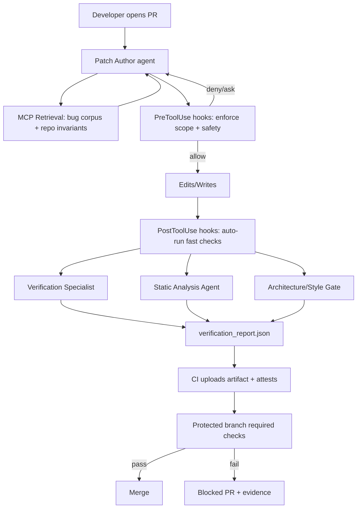
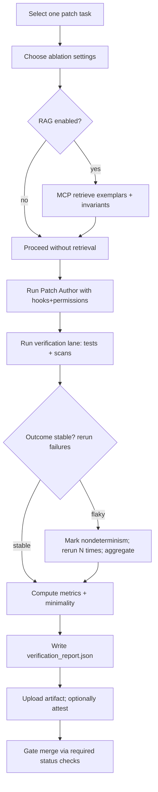

# Production-Grade Defenses for LLM Code-Generation Failures in Claude Code Workflows

## Executive summary

**Snapshot date:** 2026-03-23 (America/New_York).

**Concise plan (what this report does):**  
It inventories practitioner-accessible “AI/LLM bug corpora” and related issue collections; then designs a production-grade (“luxury”) defense layer for Claude Code with subagents, hooks, MCP-backed retrieval, immutable verification reports, and PR gating; compares major mitigation families (RAG, static rules, runtime verification loops, mutation/property testing, formal methods); and finishes with an integration blueprint and a prioritized build list plus an ablation protocol for causal auditing ~40 patch/edit tasks. citeturn9view0turn8view2turn8view1turn8view3turn8view4

**Key conclusions (high confidence, based on primary docs and runnable repos):**

- Claude Code already includes the primitives you need for a production-grade defense-in-depth system: **subagents** defined as Markdown with YAML frontmatter, **hooks** with structured JSON payloads (including session IDs, transcripts, permission modes, and agent identifiers), **permissions modes**, and **MCP** for tool/data connectivity. citeturn8view2turn8view1turn3search2turn3search8turn3search3  
- A “luxury” layer should center on **evidence** (tests, scans, reruns, diffs, and retrieval trace) packaged into an **immutable verification report** and enforced as a **required merge gate** using protected branches and required status checks. citeturn8view4turn3search3turn3search11turn2search5turn2search12  
- RAG helps most when your failures are driven by **missing context / local invariants / repeated historical pitfalls**; static rules help when failures are **patternable**; runtime verification loops help when failures are **semantic and test-detectable**; mutation/property testing helps when the failure is **silent wrong output** that tests currently miss; and formal methods help for **narrow, high-criticality invariants**. citeturn5search0turn5search1turn4search3turn1search10turn6search3  

## Bug corpora and issue collections capturing AI/LLM-introduced or AI-assisted bugs

The assets below are public, English, and practitioner-accessible. Some are “true corpora of AI-generated code + observed failures,” while others are **bug-injection or evaluation frameworks** that are extremely useful for building your own failure-mode corpus and for retrieval-augmented defenses.

### Inventory table

Each entry includes: title, URL, maintainer (repo owner), scope, representative example entries (short paraphrase), and integration notes for tests or RAG.

| Corpus / collection | Maintainer | Scope (what it captures) | Representative example entries (paraphrase) | Integration notes for tests or RAG |
|---|---|---|---|---|
| DevGPT: Studying Developer–ChatGPT Conversations | `NAIST-SE` | Six snapshots of JSON covering GitHub issues/PRs/discussions/commits/code files + Hacker News threads, mined via shared ChatGPT links; includes prompt/answer turns and code blocks extracted. citeturn9view0turn0search20 | Example records include “Prompt”, “Answer”, and a list of extracted code blocks with placeholders, plus linked GH artifacts describing how code was used/discussed. citeturn9view0 | **RAG**: index conversation turns + linked issue/PR outcomes; retrieve “similar prompt + outcome” exemplars before patching to avoid repeating mistakes. **Tests**: mine threads mentioning “bug/fix/regression” to generate candidate regression tests. citeturn9view0 |
| ChatGPT-CodeGen-Analysis (LeetCode tasks + pass/fail + quality issues) | `yueyueL` | 2,033 LeetCode tasks; ChatGPT-generated solutions (Python/Java) with fields like `is_pass`, error type/info, and `quality_info` from static analysis; includes scripts for evaluation and “feedback with static analysis/runtime” experiments. citeturn9view1turn0search1 | Example entry fields include task `difficulty`, `test_cases`, and generated code with `is_pass` plus a textual error descriptor and static-analysis “quality issue” descriptors. citeturn9view1 | **RAG**: index by `error`/`quality_info` and retrieve “similar failure signature” fixes; use as prior examples when your patch task looks like “runtime error” vs “quality smell.” **Tests**: reuse task test cases to validate “patch minimality vs correctness.” citeturn9view1 |
| Dataset: Security Weaknesses of Copilot-Generated Code in GitHub Projects (Zenodo) | entity["organization","Zenodo","research data repository"] (dataset creators listed on Zenodo) | Dataset contains collected source files, scan commands/results, filtered results, before/after fixes, and a spreadsheet mapping projects/files that contain Copilot-generated code. citeturn0search2 | Example contents include `scan-result/` (commands + scan outputs), `fix-result/` (snippets before/after fixes), and `project-url.xlsx` mapping repos to files labeled as containing Copilot code. citeturn0search2 | **RAG**: index “weakness type → fix pattern” snippets and retrieve remediation templates. **Tests**: treat fixes as regression targets; add rules to ensure fixes aren’t reverted by LLM edits. citeturn0search2 |
| GHRB: GitHub Recent Bugs (real bugs after Sep 2021 cutoff) | `coinse` | Collection of real-world Java bugs merged after Sep 2021, with Docker/CLI tooling; explicitly designed to reduce contamination concerns when evaluating LLM-based debugging. citeturn9view2turn1search0 | The README enumerates projects/bug counts and reports a total count (example: “Total 135” as of Jan 1, 2026). citeturn9view2 | **Tests**: use as a “patch harness” to ensure your verification loop works (checkout buggy/fixed); great for validating CI+agent gating. **RAG**: index bug reports + reproducing tests (if available) to retrieve similar bug patterns for your own repo. citeturn9view2turn1search1 |
| LIBRO: LLM Induced Bug Reproduction | `coinse` | Replication package: takes a bug report + existing test suite, outputs ranked bug-reproducing test candidates; runs in Docker; supports evaluation on Defects4J and GHRB. citeturn10view0 | Example “success” criterion described: a generated test fails on buggy version but passes on fixed version, with execution logs recorded. citeturn10view0 | **Tests**: integrate as “test augmentation”: before patching, generate candidate reproducing tests; gate changes on those tests. **RAG**: index bug reports + generated-test rationales as retrieval exemplars for “what test catches this class of bug.” citeturn10view0turn9view2 |
| Cheddar Bench (bug injection + agent evaluation with ground truth) | `przadka` | Unsupervised benchmark for CLI coding agents: challenger injects bugs and writes `bugs.json` ground truth; reviewer agent emits `bugs/*.json`; judge matches; supports repeated scoring and publishes dataset snapshots with hashes. citeturn10view1turn0search7 | Example artifacts include a ground-truth `bugs.json` manifest and reviewer findings; benchmark reports 2,603 injected bugs across 150 challenges and uses repeated scoring (median-of-N). citeturn10view1 | **RAG**: treat `bugs.json` entries as “labeled failure exemplars” and retrieve similar bug mechanisms/locations during patch review. **Tests**: use injection workflow to produce your own repo-specific bug corpus and tune Semgrep/CodeQL rules to catch them. citeturn10view1turn0search11 |
| Ultimate Bug Scanner (LLM-specific bug pattern scanning) | `Dicklesworthstone` | A tool positioned as “detecting LLM-specific bug patterns”; includes installation modes and “integrity-first” verification of installs; accompanied by an agent quick-reference telling agents to run it before commits. citeturn2search1turn2search4 | Representative patterns are described as “likely bugs for fixing early,” with agent guidance like running `ubs` on diffs/staged changes. citeturn2search4 | **Static checks**: use as a fast “LLM-smell gate” pre-commit and CI. **RAG**: index its findings/rules and retrieve mitigation guidance when a rule fires. citeturn2search1turn2search4 |
| Truscan (Semgrep SDK-based LLM security scanner) | `spydra-tech` | Python security scanner built using Semgrep Python SDK, targeting AI/LLM-specific vulnerabilities; designed to run in GitHub Actions and back a VS Code extension. citeturn1search3turn1search10 | Example output is typically SARIF/scan findings (as implied by “run in GitHub Actions” + Semgrep SDK design). citeturn1search3turn5search7 | **CI gate**: run in Actions, upload SARIF into GitHub code scanning, and require “no high findings” before merge. **RAG**: index rule IDs → remediation guidance for LLM orchestration issues. citeturn1search3turn4search9 |
| LLMSecEval (security prompt dataset to evaluate code-gen security) | `tuhh-softsec` | Dataset of natural-language prompts covering security scenarios (mapped to CWEs) to generate code and evaluate security; positioned for prompt engineering and secure-code evaluation. citeturn2search3turn2search28 | Representative entries are security-themed prompts (e.g., covering many of the “Top-25 CWE” scenarios) plus secure example code (per paper). citeturn2search28 | **Tests**: incorporate as “security regression prompts” for your code-gen pipeline (generate code, then scan). **RAG**: retrieve prompt→secure pattern exemplars when patching security-sensitive code. citeturn2search3turn1search10 |
| AICGSecEval (project-level AI-generated code security evaluation) | `Tencent` | Repository-level evaluation framework for AI-generated code security (project-level workflows). citeturn2search31 | Representative content: a benchmark framework described as “project-level” and aligned to real development workflows. citeturn2search31 | **CI**: adapt “project-level” checks into your pipeline as a “security lane,” especially for PRs with dependency changes or auth boundaries. citeturn2search31turn5search7 |
| CyberSecEval 4 / AutoPatchBench (security patching benchmark) | entity["company","Meta","technology company"] | CyberSecEval 4 introduces AutoPatchBench to measure an LLM agent’s capability to automatically patch security vulnerabilities in native code; described in both benchmark docs and engineering blog. citeturn6search4turn6search0turn2search25 | Representative: a benchmark explicitly for “automatic patching” of vulnerabilities, with automated verification expectations. citeturn6search4turn6search0 | **Tests**: useful as external “security patch harness” validation—especially if your patch system may later generalize beyond Python. **RAG**: index patch patterns for vulnerability classes and retrieve as high-level guidance. citeturn6search0turn6search4 |

**Practical takeaway for your Python-first repo:** the most immediately useful corpora for building a retrieval memory and a failure-mode suite are **DevGPT** (real prompts + downstream artifacts), **ChatGPT-CodeGen-Analysis** (labeled pass/fail + quality info), and **Cheddar Bench** (structured ground truth + repeatable scoring). citeturn9view0turn9view1turn10view1

## Luxury defense architecture for Claude Code workflows

This section designs a production-grade “luxury” layer that you can actually implement: specialized subagents, deterministic hook enforcement, MCP-backed retrieval, tamper-evident verification reports, and merge gating.

### Component list and roles

The architecture is built from these primitives:

- **Claude Code configuration & policy:** `.claude/settings.json` (team-shared), `.claude/settings.local.json` (local overrides), repo-level `CLAUDE.md`; documented scopes determine precedence and sharing. citeturn7search5turn3search17  
- **Subagents:** defined in Markdown files with YAML frontmatter; can be created via `/agents`, stored per-scope; can have tool restrictions, permission modes, hooks, and skills. citeturn8view2turn3search1  
- **Hooks:** lifecycle event handlers with structured JSON inputs; crucially include `session_id`, `transcript_path`, `permission_mode`, and for subagents `agent_id` and `agent_type`. Hooks can block or allow tool execution by acting as middleware around tool calls. citeturn8view1turn7search15  
- **MCP retrieval:** Claude Code connects to external tools/data via MCP (open standard) and warns about prompt-injection risk from untrusted servers. citeturn8view3turn3search34turn3search10  
- **CI enforcement:** protected branches + required status checks enforce no-merge unless checks pass. citeturn3search3turn3search11turn3search7  
- **Immutable provenance:** GitHub artifact attestations provide “unfalsifiable provenance and integrity guarantees,” include commit SHA/workflow linkage, and can be produced via `actions/attest`. citeturn8view4turn2search12turn2search5  
- **Standards alignment:** SLSA provenance describes verifiable artifact production metadata; in-toto defines attestations as authenticated metadata for software artifacts, meant for automated policy engines (useful as a conceptual model even if you only use GitHub attestations initially). citeturn6search1turn6search2turn6search14  

### Interfaces, data flows, required logs, and failure signals

Below are the core components and the production-grade interface contracts they should expose.

#### Patch Author agent

**Goal:** produce the smallest correct change and a structured intent record.

**Inputs:** issue/patch request, relevant files, retrieved context bundle.  
**Outputs:** diff + `patch_intent.json` (invariants, scope boundaries, commands to verify).  
**Required logs:** chosen template ID; retrieved doc IDs; files touched; diff size; described invariants; planned verification commands.  
**Failure signals:** touches forbidden paths; diff exceeds max; claims verification without command evidence (enforced by hooks/CI). citeturn8view1turn3search3  

**Claude Code mechanism:** run as main session (or as a subagent invoked headlessly) with strict permissions. Hooks can enforce “minimal diff” and “no tests changes” by denying tool calls at `PreToolUse`. citeturn8view1turn3search0turn3search3  

#### Verification Specialist subagent

**Goal:** run tests and checks; produce an evidence-based verdict.

**Inputs:** patch diff + verification plan.  
**Outputs:** `verification_report.json` section for tests (results + reruns).  
**Required logs:** test commands; stdout/stderr excerpts; failing test IDs; rerun outcomes; environment details; flaky flag.  
**Failure signals:** nondeterminism (`reruns` inconsistent); tests fail; verifier cannot reproduce claims. citeturn8view1turn3search3  

**Why subagent:** subagents have their own context and tool restrictions; this prevents the Patch Author from “grading its own homework,” a common operational failure mode in agentic systems. citeturn8view2turn3search1  

#### Static Analysis subagent (Semgrep + CodeQL lane)

**Goal:** catch patternable bugs and security issues fast, with deterministic outputs.

**Inputs:** repo checkout + diff scope.  
**Outputs:** SARIF files + normalized findings in the verification report.  
**Recommended tools:** Semgrep (open-source static analysis supporting CI/pre-commit) and CodeQL libraries/queries + codeql-action for GitHub security products. citeturn1search10turn5search6turn5search15  
**Required logs:** rule IDs, severity, file/line, whether in diff.  
**Failure signals:** new HIGH findings; secret leakage; dangerous exception swallowing; injection sinks. citeturn1search10turn4search9turn5search15  

**GitHub integration:** code scanning accepts SARIF uploads; CodeQL action can upload SARIF automatically, and third-party tools can upload via `upload-sarif`. citeturn4search9turn5search15  

#### Architecture/Style Gate subagent

**Goal:** enforce repo-specific maintainability constraints (function length, file size, argument count, complexity) as deterministic gates.

**Inputs:** diff + repo style rules (skills, CLAUDE.md).  
**Outputs:** violations list in report; optionally a patch plan (but does not edit code).  
**Required logs:** rule hits (e.g., “function too long”), changed functions affected, thresholds.  
**Failure signals:** function/file thresholds exceeded; “god function” refactors; broad exception swallowing patterns (also captured via Semgrep). citeturn2search1turn1search10  

**Note:** Claude Code skills can encode conventions and be referenced when appropriate; skills have YAML frontmatter and can disable model invocation or restrict tools. citeturn3search9turn8view2  

#### Retrieval layer via MCP (RAG-backed context)

**Goal:** provide curated “bug exemplars,” prior incidents, best-practice patches, and local invariants to the Patch Author and reviewers.

**Inputs:** query bundle (diff summary + error signature + file paths) and filters (language, module, vulnerability tags).  
**Outputs:** top-k retrieved exemplars, each with doc ID, source, short excerpt, and “why relevant.”  
**Required logs:** retrieved doc IDs + scores + snippet hashes; whether exemplar was used; any untrusted content warnings.  
**Failure signals:** retrieval includes untrusted content for high-risk paths; retrieval contradicts local invariants; prompt injection risk from untrusted MCP servers. Claude Code explicitly warns to trust MCP servers and be careful about servers that fetch untrusted content. citeturn8view3turn3search2turn3search34  

**RAG conceptual grounding:** RAG combines parametric generation with non-parametric memory via retrieval, enabling better grounding when documents are available. citeturn6search1turn3search10turn6search2  

#### Immutable verification report + provenance

**Goal:** make verification outputs tamper-evident and enforceable as merge conditions.

**Mechanism:** produce `verification_report.json` as a CI artifact; upload it; then generate an artifact attestation tying it to the workflow, commit SHA, and event. Artifact attestations are explicitly described as “unfalsifiable provenance and integrity guarantees,” and GitHub’s guide explains required permissions plus using `actions/attest`. citeturn8view4turn2search5turn2search12  

**Optional standards alignment:** treat the report as a “predicate” in an in-toto style statement, and treat the CI pipeline as emitting SLSA-style provenance at least at the “build instruction link” level. citeturn6search2turn6search1turn6search14  

### Mermaid data-flow diagram



## Comparative analysis of mitigation approaches

This section compares five families: RAG, linters/AST rules, runtime verification agents, mutation/property testing, and formal methods. “Cost/latency” is given qualitatively (low/med/high) relative to typical CI and developer workflows.

### Comparison table

| Approach | Strengths | Weaknesses | Cost/latency | Best-addressed failure modes | Representative public repos/docs |
|---|---|---|---|---|---|
| RAG (retrieval-augmented generation via MCP) | Improves grounding in repo-specific rules and past incidents; scalable when you have curated corpora | Retrieval errors can mislead; requires index maintenance; needs retrieval trace logs | Med | Spec misunderstanding due to missing context; repeated “same bug again”; policy/regression lore | MCP in Claude Code + MCP standard docs citeturn8view3turn3search10turn3search34; DevGPT corpus citeturn9view0 |
| Linters / AST/static rules (Semgrep/CodeQL/Bandit-like) | Deterministic, CI-friendly; catches patternable correctness/security issues quickly; integrates with code scanning via SARIF | Limited for deep semantic correctness; can be noisy; needs custom rules for repo-specific invariants | Low–Med | API misuse patterns, insecure patterns, exception swallowing, secrets, known bug patterns | Semgrep repo citeturn1search10; CodeQL libraries/queries citeturn5search6; codeql-action uploads results to GitHub citeturn5search15turn4search9; Truscan (LLM-specific security scanner) citeturn1search3 |
| Runtime verification agents (generate→run→repair loops) | Directly tests real behavior; best for patch tasks with solid regression suites; can detect semantic mismatch if tests are meaningful | Dependent on test quality; slow if integration tests heavy; nondeterminism requires reruns | Med–High | Wrong output, regressions, integration failures, “works locally but not CI” | Claude Code hooks support automation around tool calls and JSON payload logging citeturn8view1turn3search8; Cheddar Bench emphasizes repeat scoring due to stochasticity citeturn10view1 |
| Mutation + property-based testing | Finds silent wrong-output by challenging tests; property tests generate edge cases; mutation testing exposes weak tests by running suite on small code mutations | Mutation is expensive and can be long-running; properties require invariant design | High | “Passes tests but wrong,” edge-case failures, brittle solutions | Hypothesis description citeturn5search0turn5search30; Cosmic Ray mutation testing runs suite for each mutation citeturn5search1turn5search17; mutmut mutation tester citeturn4search2; Cosmic Ray notes parallelization to cope with long runtimes citeturn5search28 |
| Formal methods / symbolic execution / verification-aware languages | Highest assurance for well-specified invariants; can find counterexamples systematically (symbolic) or prove spec conformance (verification-aware) | High adoption/spec cost; can be slow; often best on small pure components | High | Critical invariants (parsers/validators/auth decisions), deep corner cases, correctness-by-contract | CrossHair uses symbolic inputs + SMT solver to find counterexamples citeturn4search3turn4search7; Dafny verification-ready language and spec-driven verification citeturn6search3turn6search15 |

**Practical synthesis for patch/edit tasks:** start with runtime verification + static gates as the “daily lane,” then reserve mutation/property testing for “nightly” or for the subset of sensitive modules where silent wrong-output is most costly. citeturn5search28turn3search3turn4search9  

## End-to-end integration blueprint

This section shows how to combine: curated bug corpus + RAG index + verification agents + CI gates + Semgrep/CodeQL rule packs into one reproducible pipeline.

### Pipeline data-flow and sequence diagrams

#### Mermaid sequence diagram

```mermaid
sequenceDiagram
  autonumber
  participant PR as PR opened/updated
  participant CC as Claude Code (Patch Author)
  participant MCP as MCP Retrieval Server
  participant CI as CI Runner
  participant T as Tests (pytest)
  participant SA as Static Analysis (Semgrep/CodeQL)
  participant VR as Verification Report
  participant AT as Attestation
  participant PB as Protected Branch Gate

  PR->>CC: Start patch workflow (strict policy)
  CC->>MCP: retrieve_similar_exemplars(query, tags, paths)
  MCP-->>CC: top_k exemplars + IDs + snippets
  CC->>CI: Emit diff + patch_intent.json (invariants + commands)
  CI->>T: Run tests (rerun failures N times)
  CI->>SA: Run Semgrep + CodeQL; generate SARIF
  SA-->>CI: Findings (SARIF/JSON)
  T-->>CI: Test results + logs
  CI->>VR: Build verification_report.json
  CI->>AT: Upload artifact + attest (actions/attest)
  AT-->>PB: Status checks + attestation metadata
  PB-->>PR: Merge allowed iff required checks pass
```

All of these components map to documented primitives: Claude Code hooks and subagents provide structured logging inputs; MCP provides tool/data connectivity; branch protections enforce required checks; artifact attestations create tamper-evident provenance; code scanning consumes SARIF. citeturn8view1turn8view3turn3search3turn8view4turn4search9  

### Copyable implementation snippets

#### Indexing a bug corpus (Python pseudocode)

```python
# scripts/build_bug_index.py
# Build a simple JSONL corpus suitable for vector indexing.
# Input examples: DevGPT prompt/answer turns, Cheddar bugs.json entries,
# ChatGPT-CodeGenAnalysis error/quality records, Zenodo fix-result diffs.

import json
import hashlib
from pathlib import Path

def stable_id(source: str, payload: str) -> str:
    h = hashlib.sha256((source + "\n" + payload).encode("utf-8")).hexdigest()
    return f"{source}:{h[:16]}"

def iter_docs():
    # Example: ingest DevGPT extracted conversations
    for p in Path("corpora/devgpt").glob("*.json"):
        data = json.loads(p.read_text(encoding="utf-8"))
        yield ("devgpt", json.dumps(data, ensure_ascii=False))

    # Example: ingest Cheddar bugs.json and reviewer findings
    for p in Path("corpora/cheddar").glob("**/*.json"):
        yield ("cheddar", p.read_text(encoding="utf-8"))

def main(out_path="bug_corpus.jsonl"):
    with open(out_path, "w", encoding="utf-8") as f:
        for source, payload in iter_docs():
            doc_id = stable_id(source, payload)
            f.write(json.dumps({
                "doc_id": doc_id,
                "source": source,
                "text": payload,
                "tags": [],
            }, ensure_ascii=False) + "\n")

if __name__ == "__main__":
    main()
```

Corpus sources and their structures are documented in each repo/dataset (DevGPT snapshots and fields; Cheddar `bugs.json`; ChatGPT-CodeGenAnalysis `is_pass`/`error`/`quality_info`; Zenodo `fix-result`). citeturn9view0turn10view1turn9view1turn0search2  

#### Retrieval call via MCP (interface sketch)

```json
{
  "tool": "retrieve_similar_exemplars",
  "input": {
    "query": "Patch wrongly swallowing exceptions in payment validation",
    "paths": ["src/payments/validator.py"],
    "tags": ["exception-handling", "silent-failure", "python"],
    "k": 8
  }
}
```

MCP is an open standard for connecting AI applications to external tools and data sources, and Claude Code can connect to tools via MCP servers. citeturn3search10turn8view3  

#### Claude Code subagent example (retrieval + patch author)

Below is a **template** of a project subagent file you can store in `.claude/agents/` (subagents are Markdown with YAML frontmatter). citeturn8view2turn7search5  

```md
---
name: patch-author-strict
description: Minimal-diff patch author with retrieval and evidence requirements
tools: Read, Grep, Glob, Bash, Edit, Write
---

SYSTEM:
You are the Patch Author. Produce the smallest correct change.

MUST:
- Minimal diff. Do not refactor unrelated code.
- Do not modify tests unless explicitly requested.
- Before editing, ask MCP retrieval for similar bugs and repo invariants.
- After editing, run tests and static checks and record commands/results in verification_report.json.

When uncertain:
- Ask for more context or propose a small diagnostic test.
```

Key mechanics (subagent format, tool lists, scope/locations) are documented in the Claude Code subagents guide. citeturn8view2turn7search5  

#### Running tests and static analysis

- **Semgrep** positions itself as fast open-source static analysis usable in IDE, pre-commit, and CI/CD. citeturn1search10  
- **CodeQL** libraries/queries power GitHub Advanced Security; the CodeQL action runs analysis and uploads results to GitHub. citeturn5search6turn5search15  
- GitHub code scanning supports SARIF uploads; CodeQL action uploads SARIF automatically when it completes analysis, and third-party tools can upload SARIF via Actions. citeturn4search9turn4search1turn5search23  

#### Verification report JSON schema (example)

```json
{
  "schema_version": "1.0",
  "snapshot_date": "2026-03-23",
  "repo": { "name": "org/repo", "default_branch": "main" },
  "run": { "workflow_run_id": "123", "commit_sha": "abc", "pr_number": 42 },
  "claude": {
    "permission_mode": "dontAsk",
    "subagents_used": ["patch-author-strict", "verifier", "static-analyzer"],
    "mcp_retrieval": { "k": 8, "doc_ids": ["devgpt:...", "cheddar:..."] }
  },
  "change": {
    "files_changed": 2,
    "diff_added_lines": 18,
    "diff_deleted_lines": 6,
    "minimality_score": 0.91
  },
  "verification": {
    "tests": {
      "command": "pytest -q",
      "status": "pass",
      "reruns": 3,
      "flaky": false,
      "failures": []
    },
    "static": {
      "semgrep": { "status": "pass", "findings": [] },
      "codeql": { "status": "pass", "alerts": [] }
    }
  },
  "gate": { "merge_allowed": true, "reason": "All required checks passed" }
}
```

Hook payloads and metadata you can include (session IDs, transcript path, permission modes, agent IDs/types) are explicitly documented in the Claude Code hooks reference, enabling strong traceability. citeturn8view1turn7search15  

#### GitHub Actions: run checks, upload artifacts, attest provenance, gate merges

Protected branches + required status checks enforce “no merge unless checks pass.” citeturn3search3turn3search11 Artifact attestations provide “unfalsifiable provenance and integrity guarantees,” and GitHub documents using `actions/attest` with required permissions. citeturn8view4turn2search5turn2search12  

```yaml
name: luxury-llm-guardrails

on:
  pull_request:
    branches: [ "main" ]

permissions:
  contents: read
  security-events: write
  id-token: write
  attestations: write

jobs:
  verify:
    runs-on: ubuntu-latest
    steps:
      - uses: actions/checkout@v4

      - uses: actions/setup-python@v5
        with:
          python-version: "3.11"

      - name: Install dependencies
        run: |
          pip install -U pip
          pip install -r requirements.txt
          pip install semgrep

      - name: Run tests
        run: |
          pytest -q

      - name: Semgrep scan (SARIF)
        run: |
          semgrep --config p/ci --sarif --output semgrep.sarif .

      - name: Upload SARIF to GitHub code scanning
        uses: github/codeql-action/upload-sarif@v3
        with:
          sarif_file: semgrep.sarif

      - name: Build verification report
        run: |
          python scripts/make_verification_report.py \
            --out verification_report.json \
            --semgrep-sarif semgrep.sarif

      - name: Upload verification report
        uses: actions/upload-artifact@v4
        with:
          name: verification-report
          path: verification_report.json

      - name: Attest verification report provenance
        uses: actions/attest@v4
        with:
          subject-path: verification_report.json
```

Key upstream references:
- SARIF upload flow and notes are in GitHub’s SARIF upload docs; they reference `upload-sarif` and CodeQL action behaviors. citeturn4search9turn5search23  
- `actions/attest` explains attestations bind artifact digests to a predicate using the in-toto format; GitHub docs explain provenance data included and SLSA build level commentary. citeturn2search12turn8view4turn6search2  

## Build roadmap and causal-audit protocol

This section prioritizes what to build first for your ~40 patch tasks, then defines whether RAG is worth it relative to linters/agents and how to measure causal impact.

### Prioritized artifacts to build (complexity vs ROI)

| Artifact | What you build | Complexity | Expected ROI for ~40 patch tasks | Rationale grounded in sources |
|---|---|---|---|---|
| Strict hooks + permissions baseline | `PreToolUse` denies dangerous edits/paths; `PostToolUse` runs fast checks; start in strict permission modes and relax | Low–Med | Very high | Hooks provide structured JSON inputs (session, transcript, permission mode, agent id/type), enabling deterministic enforcement + audit logging. citeturn8view1turn7search15turn3search0 |
| Verification-report generator + required status checks | `verification_report.json` + CI job; mark job as required check on protected branch | Med | Very high | Protected branches require status checks to pass before merge; report becomes evidence artifact. citeturn3search3turn3search11turn3search7 |
| Artifact attestations for verification report | Attest report artifact; optionally attest SBOM later | Med | High | GitHub attestations are described as “unfalsifiable provenance and integrity guarantees” and include links to workflow, commit SHA, and event. citeturn8view4turn2search5turn2search12 |
| Subagent suite | `.claude/agents/` for verifier, static analyzer, arch/style reviewer; tool restrictions and roles | Med | High | Subagents are standard, YAML-frontmatter defined, and intended for specialized workflows and tool restrictions. citeturn8view2turn7search5 |
| Static analysis gate (Semgrep + CodeQL + SARIF) | Semgrep config + custom rules; CodeQL action; SARIF upload; enforce “no high findings” | Med | High | Semgrep and CodeQL are CI-friendly; GitHub supports SARIF uploads and code scanning integration. citeturn1search10turn5search15turn4search9turn5search6 |
| Curated bug corpus v0 | Normalize DevGPT + Cheddar + your repo incidents into JSONL; keep doc IDs stable | Med | Medium–High | DevGPT and Cheddar provide structured artifacts (prompt/answer turns; bugs.json/finding payloads) that are directly indexable for retrieval. citeturn9view0turn10view1 |
| MCP retrieval service | MCP server exposing retrieval tools; log returned IDs & scores; harden against untrusted content | High | Medium | Claude Code supports MCP and warns about prompt injection risks from untrusted MCP servers; making retrieval safe is non-trivial. citeturn8view3turn3search34 |
| Mutation/property lane | Add Hypothesis properties for critical functions; run mutation testing nightly (Cosmic Ray/mutmut) | High | Medium–High | Mutation testing runs test suite per mutation and can be long-running; better as nightly but excellent for silent wrong-output. citeturn5search1turn5search28turn5search0 |
| Formal invariant lane | Use CrossHair or verify-critical modules in Dafny-like workflow when feasible | High | Targeted high ROI | CrossHair uses SMT-backed symbolic inputs to find counterexamples; Dafny is verification-aware and spec-driven but requires stronger specs/tooling investment. citeturn4search3turn6search3turn6search15 |

### Does RAG help vs linters/agents for your causal audit?

For **~40 patch/edit tasks**, RAG helps when your failures are driven by **context and memory** (e.g., “how do we handle retries in this service?” or “we already fixed this class of bug, don’t regress”). It helps less when failures are **local logic errors detectable by tests** or **patternable mistakes caught by static rules**. MCP makes retrieval feasible in Claude Code, but Claude Code also emphasizes that untrusted MCP servers can create prompt-injection risk—so retrieval must be treated as a controlled intervention, not a default “free win.” citeturn8view3turn3search10turn3search34  

**Decision heuristic (practical):**
- If a task’s root cause is “missing information / convention / prior incident,” RAG is likely beneficial (log retrieved IDs and reproduce across runs). citeturn9view0turn8view3  
- If the root cause is “semantic mismatch,” prioritize runtime verification loops, then strengthen tests with properties/mutations as needed. citeturn5search0turn5search1turn5search28  
- If the root cause is “known bad pattern,” prioritize Semgrep/CodeQL rules and enforce via SARIF gating. citeturn1search10turn5search15turn4search9  

### Instrumentation: what to log, ablation matrix, and metrics

Claude Code hooks expose a natural structured logging point: hook request JSON includes `session_id`, `transcript_path`, `permission_mode`, and when in subagents includes `agent_id` and `agent_type`. Use these as primary identifiers across runs. citeturn8view1turn7search15  

**What to log (minimum viable causal telemetry):**
- Prompt/subagent identifiers: template ID, agent name/type, tools enabled, permission mode. citeturn8view2turn8view1  
- Retrieval trace: doc IDs + scores + snippet hashes + “used/not used.” citeturn8view3turn9view0  
- Diff telemetry: files changed, LOC delta, minimality score, forbidden-path touches.  
- Verification outcomes: tests pass/fail, failing tests, rerun instability, static findings (rule IDs and severities), SARIF upload status. citeturn4search9turn3search3turn5search15  
- Provenance: attestation bundle reference or workflow run references; store report digest. citeturn8view4turn2search12  

**Ablation matrix (suggested):**

| Axis | Levels | What causal question it answers |
|---|---|---|
| Retrieval | OFF vs MCP RAG ON | Does missing context drive failures vs reasoning failures? citeturn8view3turn3search10 |
| Hooks enforcement | OFF vs PreToolUse only vs Pre+Post | Are failures preventable by deterministic enforcement vs reasoning improvements? citeturn8view1turn7search15 |
| Verification depth | tests only vs tests+Semgrep vs tests+Semgrep+CodeQL | Are failures patternable vs purely semantic? citeturn1search10turn5search15turn4search9 |
| Test strength | baseline vs +Hypothesis vs +mutation nightly | Are “successes” robust or test-coverage artifacts? citeturn5search0turn5search1turn5search28 |
| Subagent separation | single agent vs author+verifier+static analyzer | Does role separation reduce self-confirmation and improve reproducibility? citeturn8view2turn8view1 |
| Provenance mode | report only vs report+attestation | Does tamper-evident evidence improve governance and postmortem quality? citeturn8view4turn2search12 |

**Metrics to collect (core):** pass rate; diff size/minimality; rule hits; rerun nondeterminism; mutation score (killed/survived mutants) for nightly; number of retrieval exemplars used; and time-to-green. Mutation testing’s cost is reflected in its design (“run your test suite for each mutation”) and documentation emphasizing long runtimes and parallelism. citeturn5search1turn5search28turn5search17  

### Mermaid experimental protocol flowchart



## Appendix: all cited URLs (plain text, one per line)

```text
https://code.claude.com/docs/en/sub-agents
https://code.claude.com/docs/en/hooks
https://code.claude.com/docs/en/hooks-guide
https://code.claude.com/docs/en/mcp
https://code.claude.com/docs/en/settings
https://code.claude.com/docs/en/skills
https://code.claude.com/docs/en/overview
https://code.claude.com/docs/en/cli-reference
https://docs.github.com/repositories/configuring-branches-and-merges-in-your-repository/managing-protected-branches/about-protected-branches
https://docs.github.com/en/repositories/configuring-branches-and-merges-in-your-repository/managing-protected-branches/managing-a-branch-protection-rule
https://docs.github.com/articles/about-status-checks
https://docs.github.com/en/actions/concepts/security/artifact-attestations
https://docs.github.com/actions/security-for-github-actions/using-artifact-attestations/using-artifact-attestations-to-establish-provenance-for-builds
https://github.com/actions/attest
https://slsa.dev/spec/v1.0/provenance
https://slsa.dev/blog/2023/05/in-toto-and-slsa
https://github.com/in-toto/attestation/blob/main/spec/README.md
https://github.com/in-toto/attestation
https://modelcontextprotocol.io/docs/getting-started/intro
https://www.anthropic.com/news/model-context-protocol
https://claude.com/blog/what-is-model-context-protocol
https://docs.github.com/code-security/code-scanning/integrating-with-code-scanning/uploading-a-sarif-file-to-github
https://docs.github.com/en/code-security/how-tos/scan-code-for-vulnerabilities/integrate-with-existing-tools/uploading-a-sarif-file-to-github
https://github.com/github/codeql
https://github.com/github/codeql-action
https://github.com/github/codeql-action/blob/main/upload-sarif/action.yml
https://github.com/github/codeql-action/blob/main/analyze/action.yml
https://github.com/semgrep/semgrep
https://github.com/spydra-tech/truscan/blob/main/README.md
https://github.com/Dicklesworthstone/ultimate_bug_scanner
https://github.com/Dicklesworthstone/model_guided_research/blob/main/AGENTS.md
https://raw.githubusercontent.com/NAIST-SE/DevGPT/main/README.md
https://github.com/NAIST-SE/DevGPT
https://arxiv.org/html/2309.03914v2
https://raw.githubusercontent.com/yueyueL/ChatGPT-CodeGenAnalysis/main/README.md
https://github.com/yueyueL/ChatGPT-CodeGenAnalysis
https://zenodo.org/doi/10.5281/zenodo.10802054
https://raw.githubusercontent.com/coinse/GHRB/main/README.md
https://github.com/coinse/GHRB
https://raw.githubusercontent.com/coinse/libro/main/README.md
https://github.com/coinse/libro
https://raw.githubusercontent.com/przadka/cheddar-bench/main/README.md
https://github.com/przadka/cheddar-bench
https://github.com/przadka/cheddar-bench/blob/main/REPORT.md
https://github.com/przadka/cheddar-bench/blob/main/prompts/extract-manifest.system.md
https://meta-llama.github.io/PurpleLlama/CyberSecEval/docs/intro
https://engineering.fb.com/2025/04/29/ai-research/autopatchbench-benchmark-ai-powered-security-fixes/
https://meta-llama.github.io/PurpleLlama/CyberSecEval/
https://github.com/meta-llama/PurpleLlama/blob/main/CybersecurityBenchmarks/README.md
https://github.com/HypothesisWorks/hypothesis
https://hypothesis.readthedocs.io/
https://github.com/boxed/mutmut
https://github.com/sixty-north/cosmic-ray
https://github.com/sixty-north/cosmic-ray/blob/master/README.rst
https://github.com/sixty-north/cosmic-ray/blob/master/docs/source/index.rst
https://cosmic-ray.readthedocs.io/en/latest/tutorials/distributed/index.html
https://github.com/pschanely/crosshair
https://pypi.org/project/crosshair-tool/
https://github.com/dafny-lang/dafny
https://dafny.org/
https://github.com/tuhh-softsec/LLMSecEval
https://arxiv.org/pdf/2303.09384
https://github.com/Tencent/AICGSecEval
```